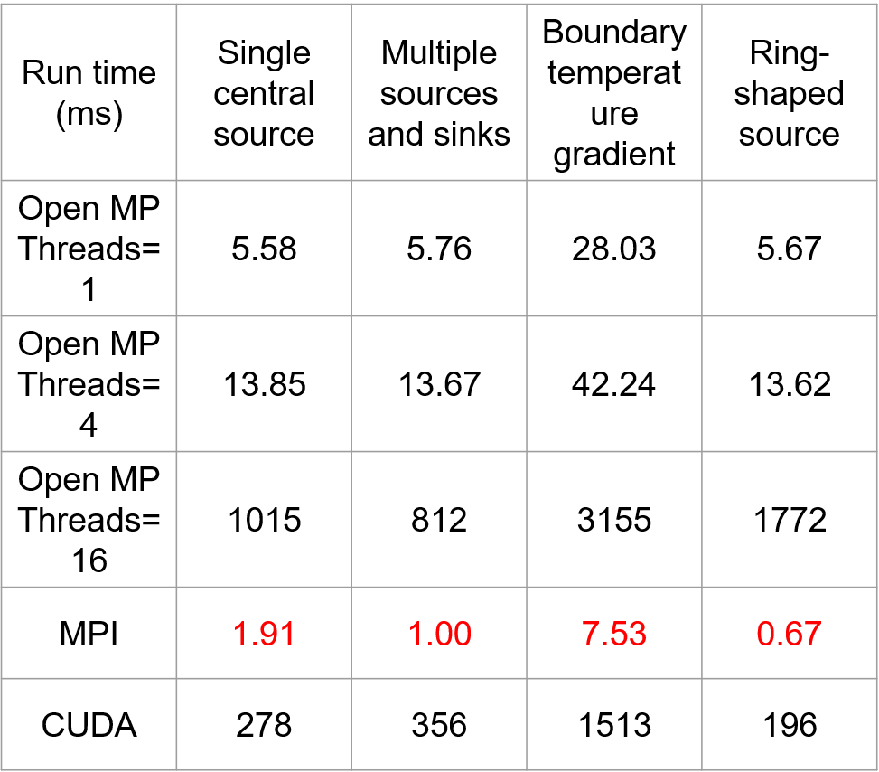

## Page 15 Heat Diffusion Demo
The Red data in the chart
was accidently measure by Open MP(4 threads) $\times$ MPI(4 process) on a 8 core laptop, hence the time exploded in the presentation (Original data was 60512
,29696
,144576
,144576
)

The corrected data is shown as followed, MPI runtime is less than Open MP in every situation. Confirms the result. 
