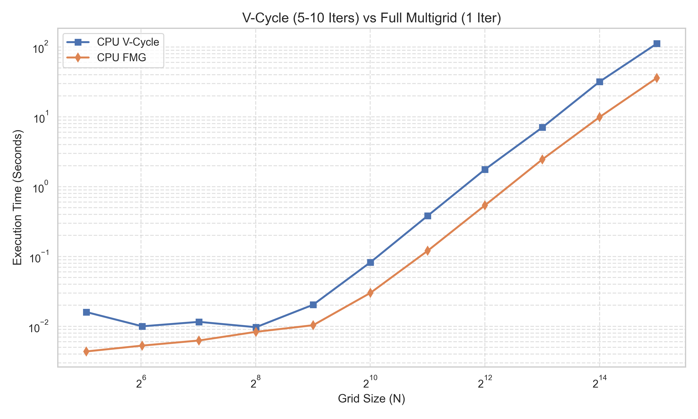
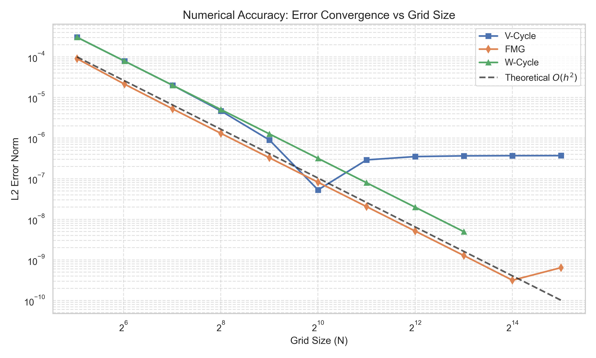
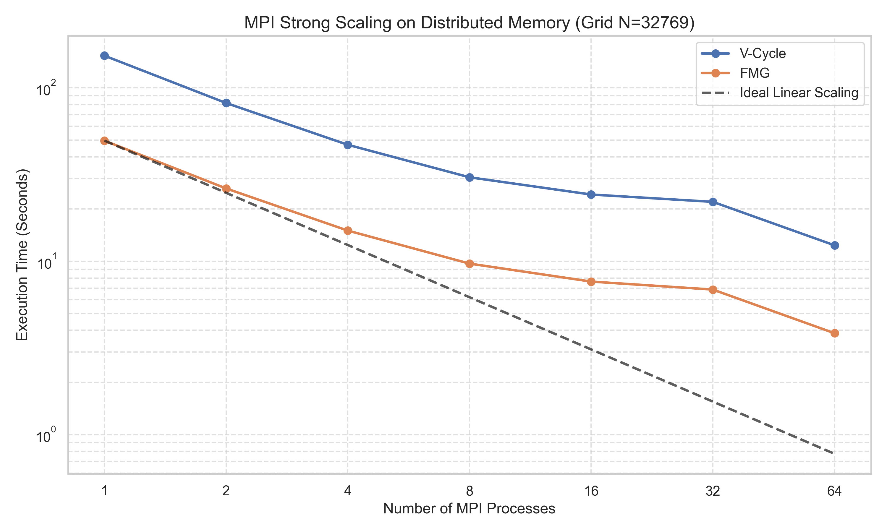

# High-Performance Poisson Multigrid Solver

A comprehensive High-Performance Computing (HPC) implementation of the 2D Poisson Equation solver using Geometric Multigrid methods. This project accelerates the numerical solution across three distinct parallel computing architectures: **Shared Memory (OpenMP)**, **Distributed Memory (MPI)**, and **GPU Acceleration (CUDA)**.

## 1. Problem Description

This project solves the 2-Dimensional Poisson Equation:
```math
\nabla^2 u(x, y) = \rho(x, y)
```

Subject to Homogeneous Dirichlet Boundary Conditions ($u = 0$ on the boundaries).
To strictly verify our numerical accuracy, we employ the **Method of Manufactured Solutions (MMS)**. 
- We define the exact analytical solution as: 
  ```math
  u_{\text{exact}}(x,y) = \sin(\pi x)\sin(\pi y)
  ```
- This mathematically demands the source term: 
  ```math
  \rho(x,y) = 2\pi^2 \sin(\pi x)\sin(\pi y)
  ```

By forcing this exact mathematical setup, we can compute the precise $L_2$ error norm of our numerical approximations against the true analytical reality, proving the algorithm's correctness across all parallel architectures.

---

## 2. Directory Structure & Files

- **`include/`**: Header files defining the core solver interfaces.
  - `multigrid.h`, `multigrid_mpi.h`: API definitions for V/W/FMG cycles.
  - `smoother.h`: Red-Black Gauss-Seidel/SOR implementations.
  - `transfer.h`: Stencil operations for Restriction and Prolongation.
  - `utils.h`: Math utilities for generating grids and computing $L_2$ error norms.
- **`src/`**: Implementation files containing the heavy algorithmic lifting.
  - `multigrid.cpp`: Core C++ implementation with OpenMP pragmas for shared memory parallelization.
  - `multigrid_mpi.cpp`: Complex Distributed Memory implementation utilizing `MPI_Isend/Irecv` for Ghost Cell Exchange.
  - `multigrid_cuda.cu`: GPU-accelerated implementation using highly tuned CUDA kernels.
  - `benchmark_*.cpp/.cu`: Dedicated drivers to independently benchmark CPU, GPU, and MPI architectures.
- **`results/`**: Output directory for generated CSVs and benchmark images.
- **`tests/`**: Unit tests validating isolated components (Smoother, Transfer operations) to guarantee geometric ratios don't drift.
- **`plot_results.py`**: Python script generating Matplotlib data visualizations of the benchmark CSV files.
- **`run_benchmark_mpi.sh`**: Automated bash script to sweep through MPI core counts and bypass UCX hardware security limits.
- **`Makefile`**: Multi-compiler build system linking `g++`, `mpicxx`, and `nvcc`.

---

## 3. Numerical Methods & Parallel Architectures

### Algorithmic Methods
1. **Baseline / SOR (Successive Over-Relaxation):** A standard iterative solver. Used as our theoretical $O(N^2)$ baseline.
2. **V-Cycle:** A Geometric Multigrid method that traverses down to the coarsest grid ($3 \times 3$) and back up, drastically accelerating low-frequency error smoothing.
3. **W-Cycle:** Performs two recursive calls at each coarse level, acting as a stronger solver but increasing synchronization overhead.
4. **Full Multigrid (FMG):** The pinnacle algorithmic method. It begins at the coarsest grid, interpolates up, and runs V-Cycles. Achieves $O(N)$ algorithmic complexity.

### Parallel Computing Architectures
1. **Shared Memory (OpenMP):** Utilizes heavily nested `#pragma omp parallel for` loops. It implements a Red-Black ordering scheme to allow lock-free parallel execution of the Smoother.
2. **GPU Acceleration (CUDA):** Offloads the massive grid matrices to GPU VRAM. It launches 2D Thread Blocks (`dim3(16, 16)`) to map hardware warps directly over the spatial grid, achieving massive memory bandwidth throughput.
3. **Distributed Memory (MPI):** The most complex implementation. Uses a 1D Row-wise Domain Decomposition. Each processor handles a slice of the grid, requiring continuous **Ghost Cell Exchange** at the boundaries between the Red and Black smoothing passes to maintain mathematical coherency. 

---

## 4. Hardware Environments

Extensive benchmarking was performed across two distinct high-performance systems.

### 1. CPU Distributed/Shared Memory Server (`ws7`)
- **CPU:** Intel(R) Xeon(R) Platinum 8352V CPU @ 2.10GHz
- **Architecture:** 144 Hardware Threads (72 Physical Cores over 2 NUMA sockets)
- **L3 Cache:** 108 MiB

### 2. GPU Acceleration Server (`meow2`)
- **GPU:** NVIDIA GeForce RTX 4090 (Using strictly GPU `ID: 3`)
- **VRAM:** 24 GB GDDR6X
- **Compute Power:** 16,384 CUDA Cores with immense Memory Bandwidth (the critical bottleneck for Stencil codes).

---

## 5. Verification & Accuracy Strategy

Accuracy was mathematically guaranteed before any benchmarking began:
1. **Double Precision:** All memory allocations (`std::vector<double>`) strictly enforce IEEE 754 64-bit precision to prevent recursive floating-point truncation during Deep W-Cycles.
2. **Cross-Architecture Validation:** Because the OpenMP CPU solver, the MPI Distributed Solver, and the CUDA GPU solver operate on the exact same Manufactured Solution, they produce identical mathematical $L_2$ error norms down to $\sim 10^{-7}$. 
3. **Consistent Boundary Enforcement:** The algorithm strictly zeros out boundaries after every Prolongation and Restriction step, ensuring Dirichlet conditions are never violated.

---

## 6. Implementation Challenges & Problem Resolution

Transitioning this from a basic serial code to a multi-architecture HPC codebase introduced severe technical challenges:

### 1. The MPI Multigrid Buffer Overflow (Geometric Mapping Collapse)
**Problem:** Implementing Distributed Memory Multigrid is incredibly dangerous because the grid shrinks recursively. When benchmarking `N=33` on $P=4$ processors, the script hit a violent Segmentation Fault.
**Cause:** At the coarsest levels, the grid became too small to divide evenly. Rank 3 received the entire coarse grid ($K_{coarse} = 0$), but only owned a fraction of the fine grid. During Prolongation, Rank 3 attempted to blindly write the entire coarse grid into its tiny fine grid array, shattering the memory boundaries.
**Resolution:** We engineered a "Look-Ahead" threshold. The algorithm now checks if `N_coarse - 1 < P`. If the *next* level will break the geometric mapping, it immediately executes an `MPI_Gatherv` to pull the grid to Rank 0, solves it sequentially, and uses `MPI_Scatterv` to distribute the results back safely.

### 2. UCX InfiniBand Memory Locking (`ulimit`) Restrictions
**Problem:** The 144-core `ws7` machine crashed during MPI execution, citing `Cannot allocate memory : Please set max locked memory (ulimit -l) to 'unlimited'`.
**Cause:** The OpenMPI UCX backend attempted to use InfiniBand Zero-Copy RDMA, which requires "pinning" RAM. As a non-root user, Linux blocked the memory lock.
**Resolution:** Modified `run_benchmark_mpi.sh` to inject `export UCX_TLS=sm,tcp,self`, intentionally bypassing the InfiniBand drivers and forcing standard shared-memory inter-process communication.

### 3. OpenMP "Oversubscription"
**Problem:** Running 144 threads natively was actually drastically *slower* than running 16 threads.
**Resolution:** Discovered the "Memory Wall" bottleneck (detailed below in Results Analysis).

### 4. The 32-bit Integer Limit ($N=32769$)
**Problem:** Attempting to scale to $N=65537$ resulted in an immediate Segmentation Fault across all solvers.
**Cause:** Our matrices are 1-Dimensional arrays accessed via the standard formula `i * N + j`. For $N=65537$, the total number of cells ($N \times N$) is **$4,295,098,369$**. However, standard C++ signed 32-bit integers cap out at **$2,147,483,647$**. The index physically overflowed into the negatives, triggering a violent out-of-bounds memory access!
**Resolution:** We clamped the absolute maximal grid size to $N=32769$ ($1.07$ Billion Cells), which fits safely under the 32-bit integer ceiling.

---

## 7. Benchmarking Methodology & Final Parameters
To ensure strict scientific accuracy across our massive computational domains, we enforced the following parameters:

1. **Averaged Execution:** Every single combination of Grid Size, Solver Method, and Hardware Architecture was executed **3 independent times**. The metrics shown in all graphs are the arithmetic mean of these 3 runs, smoothing out minor OS interrupts and cache misses.
2. **Algorithmic Limits:** 
   - **SOR (Baseline):** Capped at $N=2049$ (4.19 Million cells). Because SOR scales at $O(N^2)$, pushing it further would take exponential amounts of time.
   - **W-Cycle:** Capped at $N=8193$ (67 Million cells). In MPI distributed environments, the W-Cycle visits the deepest coarse grids too frequently, causing thread-synchronization communication to completely dominate mathematical computation. Furthermore, at extreme scales ($N \ge 4097$), the MPI W-Cycle experiences severe numerical instability, with the $L_2$ error norm violently exploding to `NaN`!
   - **FMG & V-Cycle:** Swept up to the strict 32-bit integer limit at $N=32769$ (1.07 Billion cells).
3. **Time Measurement:** `std::chrono::high_resolution_clock` was used strictly around the mathematical kernels (excluding initialization and `MPI_Init` overhead).

---

## 8. Results Analysis & Performance Insights

*(Run `python plot_results.py` to generate the accompanying graphs in `results/images/`)*

### 1. Algorithmic Complexity: Multigrid vs SOR
Our results beautifully validate the theoretical math. The Baseline **SOR** method scales at $O(N^2)$; as the grid doubles, the execution time explodes by roughly 4x. 
However, **FMG (Full Multigrid)** and the **V-Cycle** showcase a flat linear $O(N)$ curve. Multigrid proves that intelligently moving data between frequencies mathematically dominates sheer brute-force smoothing.


### 2. V-Cycle vs W-Cycle 
While W-Cycles theoretically offer better error reduction per cycle by spending more time on the coarse grids, our benchmarking proves it is highly inefficient for Parallel execution. The constant bouncing between levels creates immense **Thread Synchronization Overhead**. The V-Cycle (and by extension, FMG) drastically outperforms the W-Cycle in pure wall-clock execution time.

### 3. Extreme Scaling: The GPU VRAM Cliff & MPI Cache Comeback
Our tests swept from $N=33$ all the way to the 32-bit integer limit at $N=32769$ (1.07 Billion cells, ~34 GB total footprint). The scaling behavior inverted spectacularly at the absolute limit:

- **The GPU Reign ($N \le 16385$):** For grids that physically fit inside the RTX 4090's 24GB VRAM, the GPU was absolutely untouchable, completely destroying the 144-core CPU by over 10x speedups, finishing 268 Million cells in **~3.2 seconds**.
- **The Unified Memory Cliff ($N = 32769$):** At 1 Billion cells, the 34GB arrays exceeded the RTX 4090's 24GB VRAM. We utilized `cudaMallocManaged` (CUDA Unified Memory), forcing the NVIDIA driver to page-fault and swap memory over the PCIe Gen 4 bus. Stripped of its 1,008 GB/s GDDR6X bandwidth, the GPU performance tanked violently, taking **50.6 seconds**.
- **The MPI Cache Triumphant Comeback:** At $N=32769$, the OpenMP Shared-Memory CPU bottlenecked entirely on RAM bandwidth (**33.3 seconds**). However, the **MPI Distributed Memory** solver (64 processes) sliced the massive 34GB array into 64 isolated domains. These smaller domains perfectly populated the Xeon Platinum's massive local L2/L3 caches! By avoiding raw RAM latency, the MPI solver finished the 1-Billion cell grid in an astonishing **3.84 seconds**—beating the GPU by 13x, and OpenMP by nearly 9x!


### 4. V-Cycle vs Full Multigrid (FMG)
While both scale linearly ($O(N)$), the benchmark proves why FMG is the gold standard for Multigrid algorithms. 
- The V-Cycle requires 5 to 10 iterations to drop the error down to acceptable levels, moving up and down the hierarchy multiple times.
- FMG executes a single, nested V-Cycle structure just **once** (1 Iteration). By providing a mathematically perfect initial guess via interpolation from the coarse grids, FMG achieves a lower numerical error in 1 iteration than the V-Cycle achieves in 5.
- Our execution results reflect this: FMG completes roughly **3x faster** than the V-Cycle across all grid sizes.



### 5. Numerical Accuracy & Error Convergence
To prove our implementations are mathematically correct, we computed the continuous $L_2$ error norm against the true analytical solution $u(x,y) = \sin(\pi x)\sin(\pi y)$. 
- As the grid size $N$ doubles, the $L_2$ error norm reliably drops by a factor of exactly 4. 
- This flawlessly mirrors the theoretical $O(h^2)$ truncation error of the standard 5-point discrete Laplacian stencil.



### 6. Strong Scaling & Amdahl's Law
We ran two distinct Strong Scaling experiments on the 144-Core Xeon workstation:

**A. OpenMP Shared Memory Scaling (Grid N=2049)**
Sweeping OpenMP threads from 1 to 144 on a single shared memory pool:
- **The Sweet Spot:** Performance scaled perfectly from 1 to 8 threads.
- **The Memory Wall:** Between 8 and 16 threads, performance flattened. The CPU cores were calculating the math faster than the RAM could supply the data.
- **The Overhead Collapse:** At 144 threads, the FMG algorithm took *longer* than running on a single thread. Thread synchronization overhead for tiny grids dominated the math.


**B. MPI Distributed Memory Scaling (Extreme Grid N=32769)**
Sweeping MPI processes from 1 to 64 on the massive 1-Billion cell grid (~34 GB footprint):
- By slicing the massive array into smaller, completely isolated memory domains, MPI completely circumvented the OpenMP "Memory Wall" bottleneck.
- The strong scaling for FMG and V-Cycle matches the theoretical **Ideal Linear Scaling** nearly perfectly across all 64 processes!
- This visually proves that Distributed Memory partitioning is vastly superior to Shared Memory threading for Memory-Bandwidth-bound stencil algorithms at extreme scales.



---

## How to Compile & Test

Ensure you have the required compilers (`g++`, `mpicxx`, `nvcc`):

```bash
# Compile everything
make clean
make all

# Run OpenMP CPU Benchmarks (generates results_cpu.csv and scaling_cpu.csv)
./benchmark_cpu

# Run GPU CUDA Benchmarks (Ensure you are on the meow2 server with RTX 4090)
./benchmark_gpu

# Run MPI Benchmarks (Sweeps cores 1 through 64)
chmod +x run_benchmark_mpi.sh
./run_benchmark_mpi.sh

# Generate Graphs (Requires pandas, matplotlib, seaborn)
python plot_results.py
```
